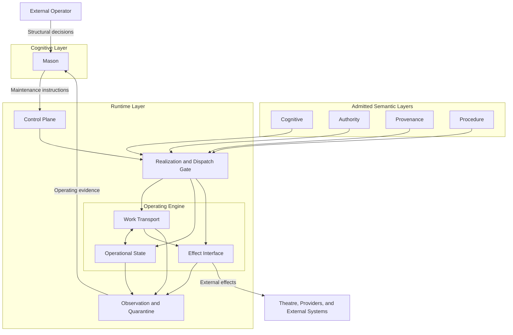
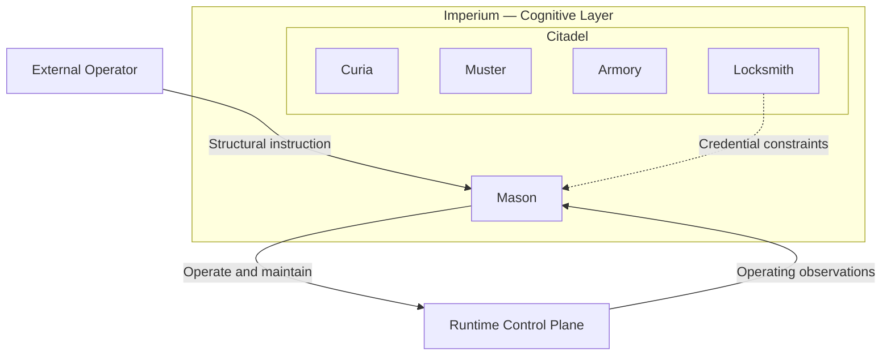

# Runtime Layer Structural Map 001

## Status

Candidate diagram derived from current Runtime and Mason drafts.

Not doctrine, production architecture, service topology, or implementation selection.

## Structural Map

## Cognitive Placement Detail

## Component Labels

| Component | Meaning |
|---|---|
| Control Plane | activation, configuration, and recovery mechanisms |
| Realization and Dispatch Gate | contract, Authority, correlation, Procedure, and version checks |
| Work Transport | queues, workers, schedulers, delivery, and retries |
| Operational State | persistence, transactions, locks, isolation, and mappings |
| Effect Interface | credential bindings, adapters, tools, and external effects |
| Observation and Quarantine | results, failures, telemetry, and indeterminate effects |

## Reading Rule

The arrows represent control, dependency, observation, and effect relationships.

They do not define the Imperium mission lifecycle.
